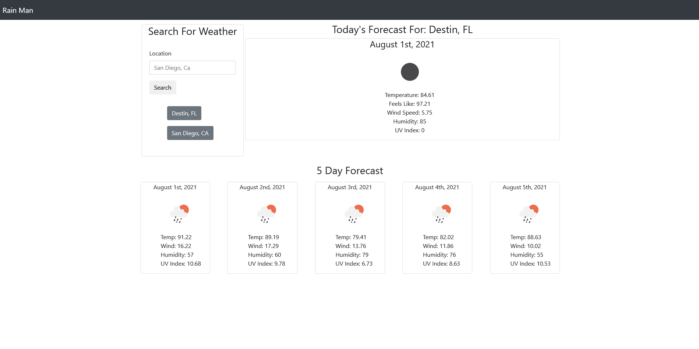

# Rain Man

## Description

A dynamic weather app that allows for the user to search by city for their local weather. It saves up to two previous searches in button form so that the user can recall past searches quickly. The site can be accessed with this [link](https://tutor78.github.io/rain-man).

## Use

- Enter a city either followed by a state/country or by itself
- Hit the search button
- For previous searches press the corresponding button and it will automatically repopulate the data location

## Preview

## Languages/FrameWorks

- HTML5
- CSS/Bootstrap
- Javascript/jQuery